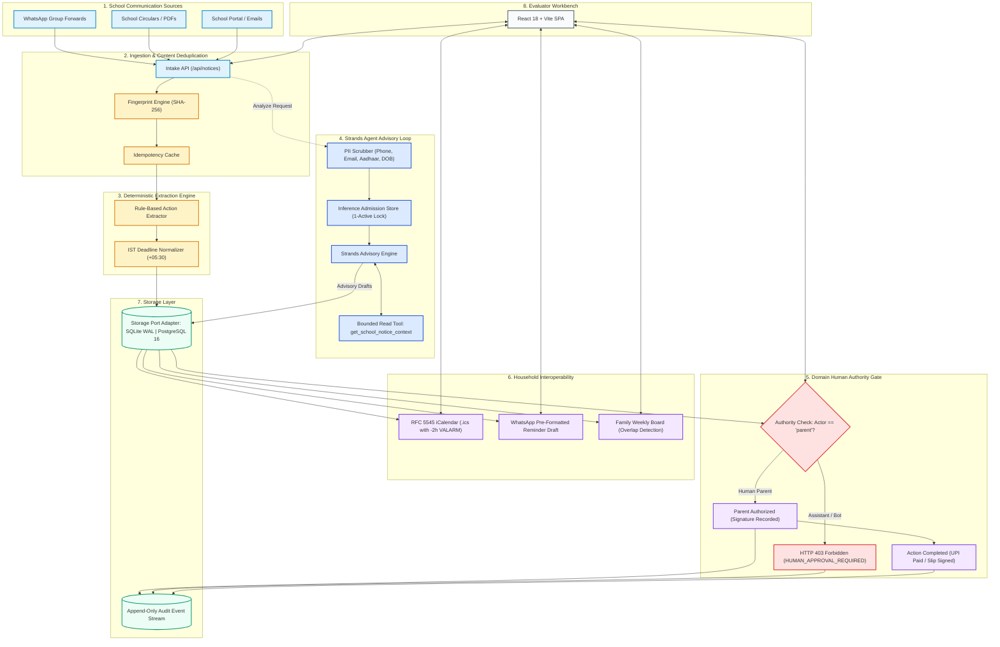

# Schoolbag Architecture & System Design (v0.5.0)

## 1. Product Vision

**Schoolbag** is an agentic assistant for families designed to turn chaotic school communication (WhatsApp forward chains, school circular PDFs, diary notes, and portal emails) into the few actionable items a family actually needs to do:
- 💳 Fee payments (with exact amounts in ₹ INR)
- 📝 Consent slips & field trip permissions
- 📦 Required classroom materials & supplies
- 🎓 Exam and academic milestones
- 📅 Device calendar integration (RFC 5545 `.ics`)
- 💬 Pre-formatted family WhatsApp reminder coordination
- 📖 Multi-child Family Weekly Board (visual school diary)

Schoolbag enforces strict boundaries: it **never** signs consent, spends money, or dispatches external communications automatically. Every suggested reminder, payment, or consent action is visibly an **ADVISORY DRAFT** requiring human parent approval.

---

## 2. Core Architectural Principles & Boundaries

1. **Zero Personal Spend ($0.00 / ₹0.00)**:
   - Uses a deterministic rule-based extractor with confidence scoring and explicit synthetic disclosure.
   - Includes a Strands Agent advisory seam using the open-source `openai/gpt-oss-20b` model via Groq's free tier and offline mock transports.
   - Strictly ₹0.00 spend across all tools, services, and tests.

2. **Strict Human Authority Gate (HTTP 403)**:
   - Automated agents, background assistants, and bots are strictly blocked from approving actions requiring parent authorization (`HUMAN_APPROVAL_REQUIRED`, HTTP 403).
   - Only authenticated human parents can authorize payments or sign consent slips.

3. **Single Bounded Read Tool**:
   - The Strands Agent interacts strictly through `get_school_notice_context`. The model has zero capability to mutate database records, execute financial transactions, or perform arbitrary network calls.
   - Hallucinations or completions generated without observed execution of the tool are rejected with HTTP 502 `ASSISTANT_INVALID_OUTPUT`.

4. **Atomic Inference Admission Safety**:
   - Concurrency Lock: Strictly 1 active inference request permitted per workspace (HTTP 429 `ASSISTANT_BUSY`).
   - Sliding Rate Limits: Max 6 req/60s, 120 req/24h, 24 completions/24h.
   - Provider 429 Cooldown: 15-minute lock on admissions after provider rate-limit signals.
   - Zero-Send Idempotent Replay: Cached response returned with 0 extra model calls.

5. **Privacy-Preserving Minimal Identifiers & PII Redaction**:
   - Pre-inference regex scrubber strips phone numbers, emails, student registration IDs, Aadhaar numbers, and dates of birth.
   - Stores only child aliases (`Kavya`, `Arun`) and class/section identifiers (`Class 5-B`, `Class 8-A`).

6. **Household Interoperability**:
   - RFC 5545 iCalendar export (`.ics`) with UTC converted timestamps (`Z` format), `X-WR-TIMEZONE:Asia/Kolkata`, and -2h `VALARM` reminder alerts.
   - Instant WhatsApp reminder draft copy with clipboard confirmation.
   - Consolidated Family Weekly Board grouping obligations by child and detecting concurrent deadline conflicts.

7. **Dual-Engine Storage Architecture**:
   - Thread-safe storage layer supporting SQLite WAL for instant zero-dependency local development and ephemeral PostgreSQL 16 for production containerized workloads.

---

## 3. End-to-End System Architecture Diagram

---

## 4. Security & Concurrency Controls

- **Optimistic Concurrency Control**:
  - Every action mutation enforces `expected_version`. If a concurrent update has occurred, the request is rejected with HTTP 409 `STATE_CONFLICT`.
- **Idempotency Protection**:
  - `Idempotency-Key` headers cache responses. Exact re-submissions return cached payloads; submissions with identical keys but altered payloads are rejected with HTTP 409 `IDEMPOTENCY_CONFLICT`.
- **Append-Only Audit Stream**:
  - All state transitions (`notice_ingested`, `action_extracted`, `approval_rejected_human_gate`, `action_approved_by_parent`, `deadline_updated`, `action_completed`, `reminder_drafted`) are immutably logged with actor attribution and timestamps.
